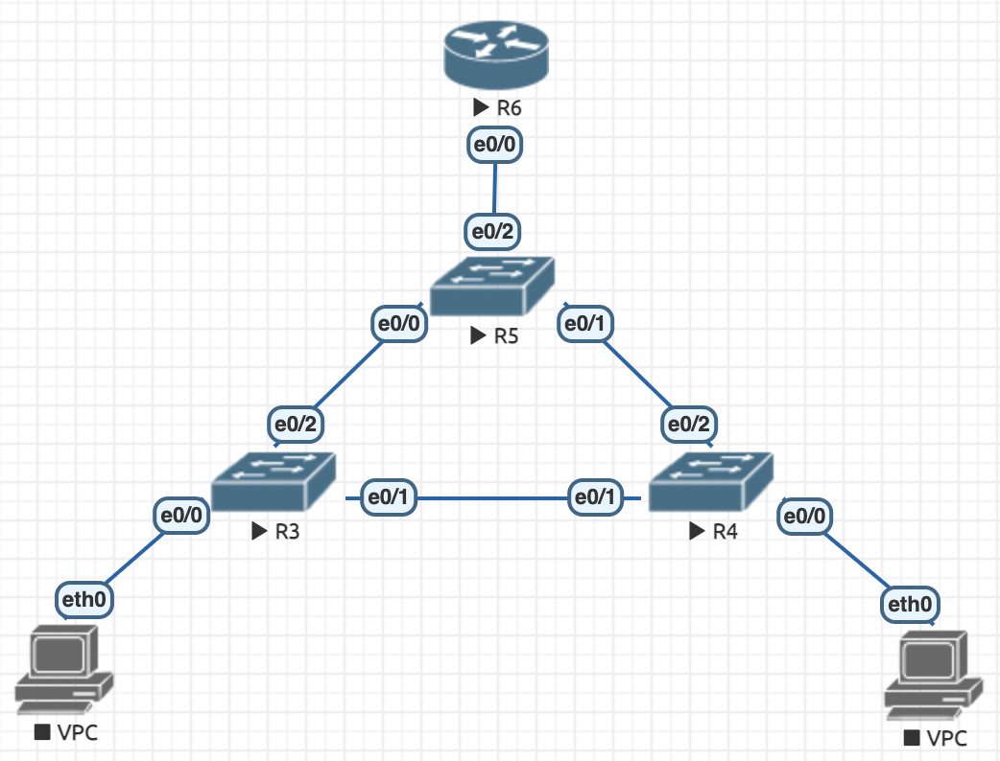

# Реализация небольшой сети офиса

Для просмотра конфигурации `show run`

1. Реализуем топологию в eve-ng, как показано на рисунке в задании (на картинке еще не прожат start для VPC):


2. Далее необходимо настроить конфигурации для R3 и R4. Они идентичны, только в одном случае мы используем `vlan 10`, а в другом `vlan 20`. Поэтому я опишу только лишь настройку для R3.

    - Переходим в режим привилегированного пользователя, а затем в режим конфигурации:
    ```
    ena
    conf t
    ```
    - Называем его осмысленно (Switch-1) и выходим
    ```
    hostname Switch-1
    exit
    ```
    - Сохраняем измененные данные и запускаем, чтобы посмотреть, что вообще все работает
    ```
    write
    ```
    - Посмотрим на текущую конфигурацию
    ```
    show run
    ```
    - Переходим в режим конфигурации и добавляем `vlan`, но ничего там не настраиваем
    ```
    conf t
    vlan 10
    exit
    vlan 20
    exit
    ```
    - Vlan-ы создались, теперь можем переходить к настройке интерфейсов
    ```
    int e0/0
    description "VPC"
    switchport mode access
    switchport access vlan 10
    exit

    int e0/1
    switchport trunk encapsulation dot1q
    switchport mode trunk
    switchport trunk allowed vlan 10,20
    exit

    int e0/2
    switchport trunk encapsulation dot1q
    switchport mode trunk
    switchport trunk allowed vlan 10,20
    exit
    ```
    - Выходим из режима конфигурации, сохраняем его и вот мы закончили с R3
    ```
    exit 
    write
    ```

    - Проводим аналогичные действия для R4 и vlan 20. 

3. Теперь время настроить конфигурацию для R5. Соединения будут настраиваться походим образом, однако будет одно оличие: вместо VPC у нас здесь будет роутер. Для роутера нужно будет настроить приоритеты у соединений.
        - Переходим в режим привилегированного пользователя, а затем в режим конфигурации:
    ```
    ena
    conf t
    ```
    - Называем его осмысленно (Switch-3) и выходим
    ```
    hostname Switch-3
    ```
    - Добавляем `vlan`, но ничего там не настраиваем
    ```
    vlan 10
    exit
    vlan 20
    exit
    ```
    - Vlan-ы создались, теперь можем переходить к настройке интерфейсов
    ```
    int e0/0
    switchport trunk encapsulation dot1q
    switchport mode trunk
    switchport trunk allowed vlan 10,20
    exit

    int e0/1
    switchport trunk encapsulation dot1q
    switchport mode trunk
    switchport trunk allowed vlan 10,20
    exit

    int e0/2
    switchport trunk encapsulation dot1q
    switchport mode trunk
    switchport trunk allowed vlan 10,20
    exit
    ```
    - Настраиваем приоритеты в сети: делаем Switch-3 (коммутатор уровня распределения) корнем для обоих vlan, что автоматом заблокирует линк доступа между Switch-1 и Switch-2 согласно протоколу stp.
    ```
    spanning-tree vlan 10,20 root primary 
    ```
    - Выходим из режима конфигурации, сохраняем его и вот мы закончили с R5
    ```
    exit 
    write
    ```

4. Настраиваем R6 – роутер: интерфейс и его подыинтерфейсы, где прописываем ip клиентов
    ```
    ena
    conf t

    int e0/0
    no shutdown
    
    int e0/0.10
    encapsulation dot1Q 10
    ip address 10.0.10.42 255.255.255.0
    exit

    int e0/0.20
    encapsulation dot1Q 20
    ip address 10.0.20.42 255.255.255.0
    exit

    exit
    write
    ```

5. Для настройки VPC нужно просто прописать ip (первая строка для vlan 10, вторая для vlan 20)
    ```
    ip 10.0.10.1 255.255.255.0 10.0.10.42
    ip 10.0.20.1 255.255.255.0 10.0.20.42
    ```

6. Для проверки всего выше написанного посылаем ping с одной VPC на другую, ну и смотрим что там происходит.