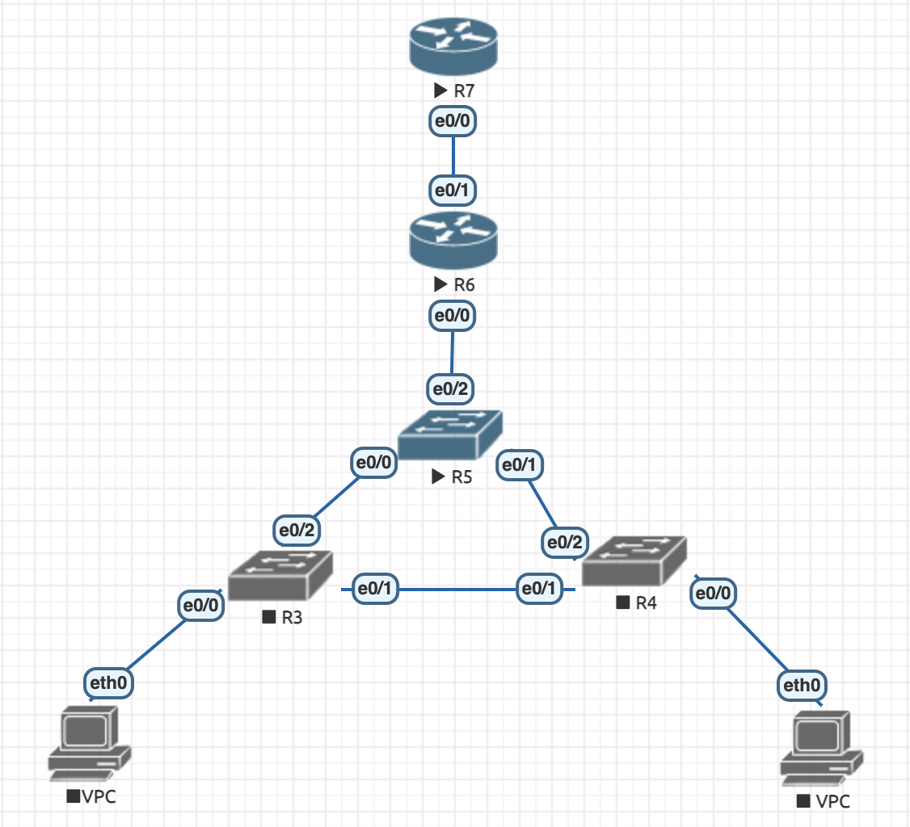

# Модернизация сети офиса из задания 1

Долетела до Турции – можно продолжать делать домашнее задание по сетям. Мне как раз удачно проверили первую домашку – сейчас будем ее модифицировать.

1. Сморим как выглядит наша модифицированная топология. На самом деле визуально выглядит почти также, мы просто добавили еще один роутер, однако конфиги в части случаев надо будет изменить. 


2. Для R3, R4 и R5 конфиги они остаются прежними – не трогаем их.

3. Настраиваем (точнее сказать донастраиваем) конфиг для R6
    - Переходим в режим привилегированного пользователя, а затем в режим конфигурации:
    ```
    ena
    conf t
    ```
    - Называем его осмысленно (Router-1) и выходим
    ```
    hostname Router-1
    ```
    - Настраиваем DHCP (ip и маску сети, DNS сервер, Default Gateway)
    ```
    ip dhcp pool p10
    network 10.0.10.0 255.255.255.0
    dns-server 8.8.8.8
    default-router 10.0.10.1
    exit

    ip dhcp pool p20
    network 10.0.20.0 255.255.255.0
    dns-server 8.8.8.8
    default-router 10.0.20.1
    exit
    ```
    - В настройках DHCP сервера исключаем первые 10 ip-адреса из выдачи клиентам (начинаем с 1, так как 0 никому не выдается)
    ```
    ip dhcp excluded-address 10.0.10.1 10.0.10.10
    ip dhcp excluded-address 10.0.20.1 10.0.20.10
    ```
    - Перенастраиваем ip
    ```
    access-list 100 permit ip 10.0.10.0 0.0.0.255 any
    access-list 100 permit ip 10.0.20.0 0.0.0.255 any
    ```
    - Донастраиваем интерфейс, который соединен с R5
    ```
    int e0/0
    no shutdown

    int e0/0.10
    no shutdown
    encapsulation dot1Q 10
    ip address 10.0.10.1 255.255.255.0
    ip nat inside
    exit

    int e0/0.20
    no shutdown
    encapsulation dot1Q 20
    ip address 10.0.20.1 255.255.255.0
    ip nat inside
    exit
    ```
    - Настраиваем интерфейс, который соединен со свежедобавленным роутером R7 (его не было в домашнем задании 1)
    ```
    int e0/1
    no shutdown
    ip address 11.0.10.5 255.255.255.0
    ip nat outside
    exit
    ```
    - Для выполнения условия, что NAT будет работать для большого количества клиентов (>10) в каждой сети
    ```
    ip nat inside source list 100 int e0/1 overload
    ip route 0.0.0.0 0.0.0.0 11.0.10.1
    ```
    - Выходим из режима конфигурации, сохраняем его и вот мы закончили с R6
    ```
    exit 
    write
    ```

4. Настраиваем конфиг для нового роутера – R7
    - Переходим в режим привилегированного пользователя, а затем в режим конфигурации:
    ```
    ena
    conf t
    ```
    - Называем его осмысленно (Router-2) и выходим
    ```
    hostname Router-2
    ```
    - Настраиваем его тут аналогично роутеру в первом домашнем задании 
    ```
    int e0/0
    no shutdown
    ip address 11.0.10.1 255.255.255.0
    exit
    ```
    - Выходим из режима конфигурации, сохраняем его и вот мы закончили с R7
    ```
    exit 
    write
    ```

5. Остались VPC, на которых надо просто получить ip
    ```
    ip dhcp
    ```

6. Как в домашнем задании 1 для проверки всего выше написанного посылаем ping, ну и смотрим что там происходит.

7. Выгружаем конфиги с помощью скрипта [pull.sh](https://github.com/gervold/otus-network-engineer/blob/main/eve-ng/deploy.md) и сдаемся!

